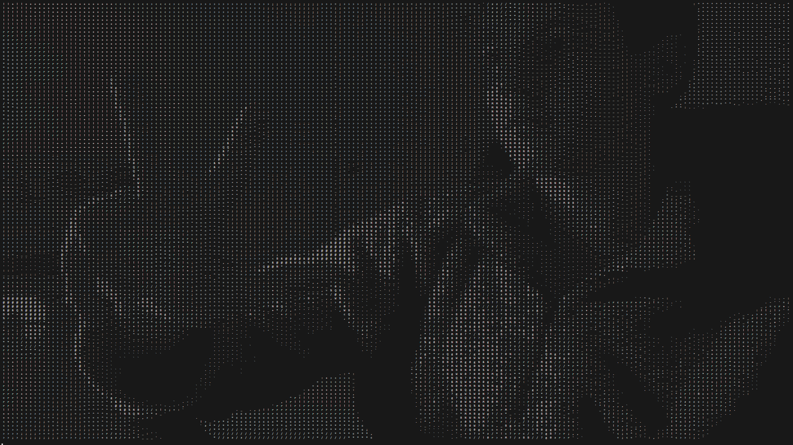
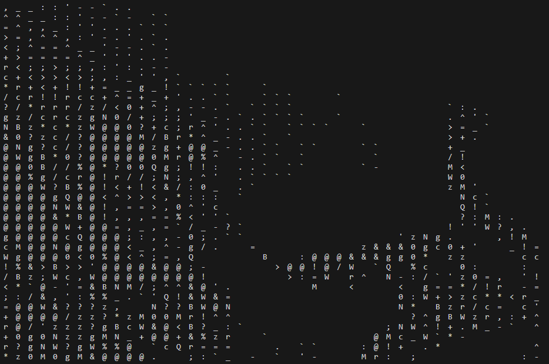

# ASCII-Camera

See camera output in the terminal!

This Python script takes in information from the camera (using `cv2`) and transforms it into ASCII art, in real-time.

### To run: `python main.py [desired resolution level]`

_Level 1 resolution_

### Resolution level

Default is 1, but if you want an experience with lower resolution you can do higher values

_Level 4 resolution_

##### How it works: instead of analysing each pixel and making it an ascii character, the program will only go over certain pixels (ex: if 2 then only translate every 2 pixels)
