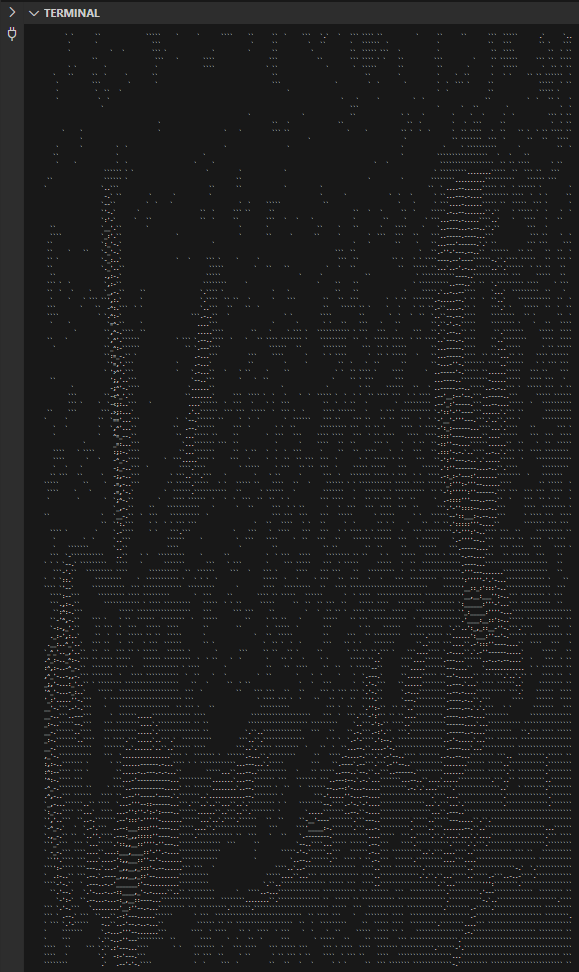

# ASCII-Camera
This python script taken in the information from the camera (using ```cv2```) and transforms it into ASCII art, realtime.
### To run: ```python main.py```
### libraries: ```cv2, os```

